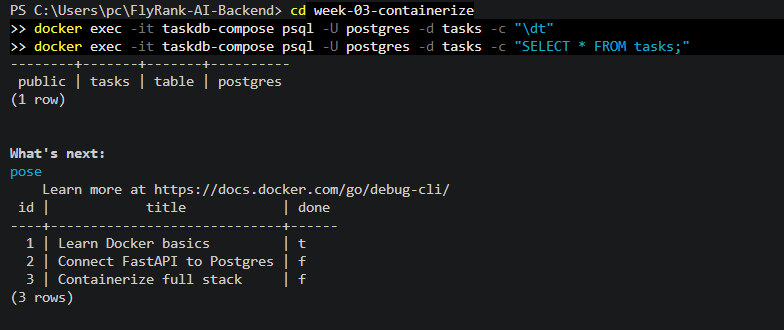

# Task API — Postgres + Docker (FlyRank A3)

FastAPI CRUD task API, backed by PostgreSQL running in Docker. Same API
as A1 (in-memory) and A2 (SQLite) — only the storage engine changed.

## Run it (one command)

```
cp .env.example .env
docker compose up --build
```

API available at `http://localhost:8000`.

## Environment variables

See `.env.example`. Only one variable needed:

| Variable       | Example                                              |
|----------------|-------------------------------------------------------|
| `DATABASE_URL` | `postgresql+psycopg://postgres:dev@db:5432/tasks`     |

## Endpoints

| Method | Path            | Success | Notes                          |
|--------|-----------------|---------|---------------------------------|
| GET    | `/tasks`        | 200     | list all tasks                  |
| GET    | `/tasks/{id}`   | 200     | 404 if not found                |
| POST   | `/tasks`        | 201     | 400 if title missing/empty      |
| PUT    | `/tasks/{id}`   | 200     | 404 if not found                |
| DELETE | `/tasks/{id}`   | 204     | 404 if not found                |

## Example request

```
curl -i http://localhost:8000/tasks
```
```
HTTP/1.1 200 OK
content-type: application/json

[{"id":1,"title":"Learn Docker basics","done":true}, ...]
```

## Data in the database

