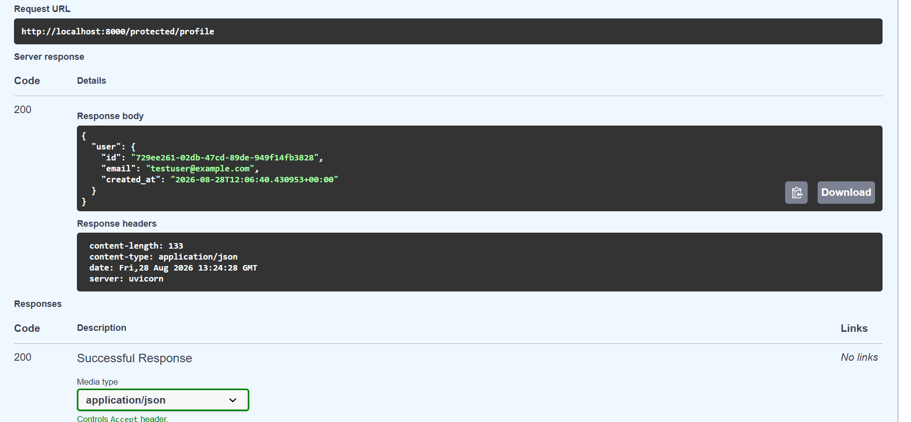

# FlyRank Auth API — Week 4 / A4

Secure REST API built with **FastAPI** + **Supabase Auth**. Handles the full authentication lifecycle — sign up, log in, token refresh, log out — and protects specific routes using a reusable JWT verification middleware.

---

## Features

- **Validation Guards** — a global exception handler converts missing/malformed input into a clean `400 Bad Request`.
- **JWT Middleware Guard** — a reusable `get_current_user` dependency verifies the Bearer token against Supabase and returns `401 Unauthorized` for missing, malformed, or invalid/expired tokens.
- **Session Management** — supports access/refresh token issuance and session sign-out via Supabase Auth.

---

## API Reference

| Endpoint | Method | Auth Required | Success | Errors | Description |
|---|---|---|---|---|---|
| `/` | GET | No | 200 | – | Health check |
| `/public/info` | GET | No | 200 | – | Public, unprotected info |
| `/auth/signup` | POST | No | 201 | 400 | Register a new user |
| `/auth/login` | POST | No | 200 | 400, 401 | Authenticate & return access/refresh tokens |
| `/auth/refresh` | POST | No | 200 | 401 | Exchange a refresh token for a new access token |
| `/auth/logout` | POST | Yes (Bearer) | 204 | 401 | End the current session |
| `/protected/profile` | GET | Yes (Bearer) | 200 | 401 | Verified user's own profile |
| `/protected/dashboard` | GET | Yes (Bearer) | 200 | 401 | Second protected route (proves the middleware is reused, not copy-pasted) |

---

## Local Setup

1. Clone the repo and move into the project folder:
   ```bash
   git clone https://github.com/Areeba-Qammar/FlyRank-AI-Backend.git
   cd FlyRank-AI-Backend/week-04-auth
   ```
2. Create a virtual environment and install dependencies:
   ```bash
   python -m venv venv
   venv\Scripts\activate       # Windows
   pip install -r requirements.txt
   ```
3. Create a `.env` file (see `.env.example` for the key names):
   ```
   SUPABASE_URL=https://your-project.supabase.co
   SUPABASE_KEY=your_anon_key_here
   PORT=8000
   ```
4. Run the server:
   ```bash
   uvicorn main:app --reload --port 8000
   ```
   Expected output: `Server running and connected to Supabase`

---

## Swagger UI

Interactive docs are served at `http://localhost:8000/docs`. Click **Authorize**, paste a JWT obtained from `/auth/login`, and test any protected route directly from the browser.

