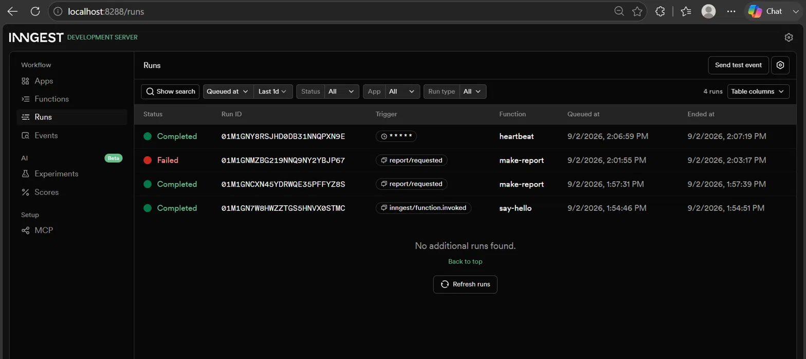

# Your First Background Job

A small FastAPI + Inngest API that demonstrates background jobs, status
polling, retries, and a cron job — built for FlyRank's backend internship,
Week 4/A7.

## What this is

- `GET /health` — liveness check
- `POST /reports` — accepts a report request, returns instantly (`202`),
  the actual 8-second "work" happens in a background job, not the request
- `GET /reports/{id}` — poll for status: `pending` → `done` (or `failed`)
- Three Inngest functions:
  - `say-hello` — wiring test (event-triggered, sleeps 5s)
  - `make-report` — the real background job (sleep 8s → build result,
    `retries=2`, deliberately fails if topic is `"fail"`)
  - `heartbeat` — cron job, runs every minute, logs pending/done/failed counts

## How to run

Two terminals, both from this folder.

**Terminal 1 — the API:**

```
$env:INNGEST_DEV = "1"
uvicorn main:app --reload --port 8000
```

**Terminal 2 — the Inngest Dev Server:**

```
inngest-cli dev -u http://localhost:8000/api/inngest
```

Dashboard: http://localhost:8288

## Endpoints & functions

| Name | Type | Trigger | What it does |
|---|---|---|---|
| `GET /health` | route | HTTP | liveness check |
| `POST /reports` | route | HTTP | validates input, saves `pending`, sends event, returns `202` |
| `GET /reports/{id}` | route | HTTP | returns report status/result, `404` if unknown |
| `say-hello` | function | event `test/hello` | wiring test, sleeps 5s |
| `make-report` | function | event `report/requested` | sleeps 8s, builds report, `retries=2` |
| `heartbeat` | function | cron `* * * * *` | logs pending/done/failed counts every minute |

## Proof: 202 then poll

Request:

```
curl.exe -i -X POST http://localhost:8000/reports -H "Content-Type: application/json" -d "@body.json"

HTTP/1.1 202 Accepted
{"id":"3c716308-420a-4442-b79c-db0e6fc691cf","status":"pending"}
```

Poll after the 8-second background job finishes:

```
curl.exe http://localhost:8000/reports/3c716308-420a-4442-b79c-db0e6fc691cf

{"id":"3c716308-420a-4442-b79c-db0e6fc691cf","status":"done","topic":"cats","result":"Report about 'cats': it's great, 10/10, would recommend."}
```

## Retries and validation

Sending `{"topic":"fail"}` triggers 3 attempts (1 initial + 2 retries) with
growing backoff, ending in a **Failed** run — visible in the dashboard trace,
error `"The report oven is broken!"`.

Sending no topic at all is rejected outright:

```
curl.exe -i -X POST http://localhost:8000/reports -H "Content-Type: application/json" -d "@body_bad.json"

HTTP/1.1 400 Bad Request
{"detail":"topic is required"}
```

No event is sent and no job run is created for this case.

**Why the difference:** a missing topic is a client mistake that will never
succeed no matter how many times it's retried, so it's rejected immediately.
A failed report build might succeed on a later attempt (a transient hiccup),
so it's worth retrying with backoff instead of rejecting outright.

## Cron expressions

- Every day at 08:00 → `0 8 * * *`
- Every Sunday at 22:00 → `0 22 * * 0`

(built and verified on crontab.guru)

## Dashboard screenshot



Shows: a completed `make-report` run with both steps, a failed `make-report`
run with its 3 retry attempts, and `heartbeat` firing on its own schedule
with no trigger from a request.

## Notes

- `reports` is an in-memory dict — it resets on every server restart
  (including `--reload` picking up a code change). Same tradeoff as A1/A2.
- Tools: Python 3.13, FastAPI, Inngest Python SDK, Inngest Dev Server (Node/npx).